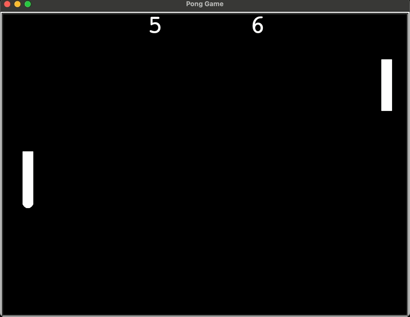

# Pong Game

A simple two-player Pong game built in Python using the `turtle` module.

## Demo
Add a GIF or screenshot here once ready.



## Features
- Two-player paddle controls
- Ball bounces off the top and bottom walls
- Ball bounces off paddles
- Score updates when a player misses the ball
- Ball speed increases after paddle collisions

## Controls
- Right paddle: Up Arrow / Down Arrow
- Left paddle: W / S

## Project Structure
- `main.py` - game loop, screen setup, controls, and collision handling
- `paddle.py` - paddle class and movement
- `ball.py` - ball movement, bounce logic, and reset behavior
- `scoreboard.py` - left and right player scoring

## How to Run
1. Make sure Python 3 is installed
2. Clone or download this repository
3. Run the game:

```bash
python main.py

# No external packages required — runs with standard Python 3
